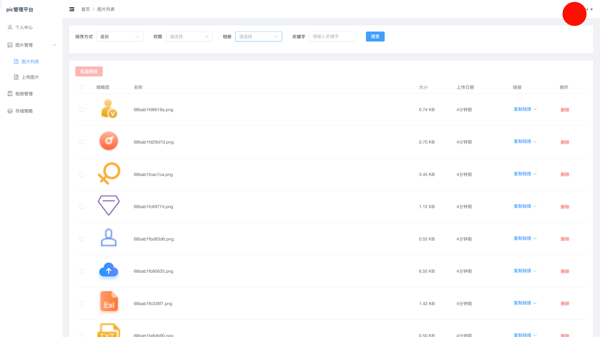
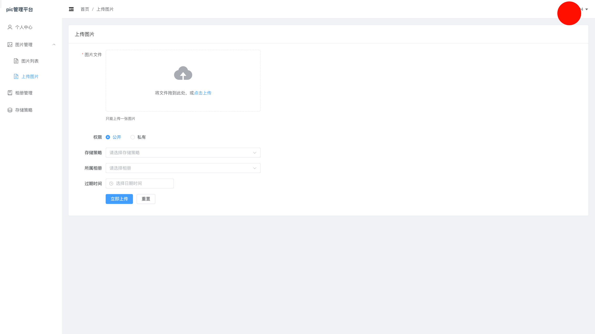
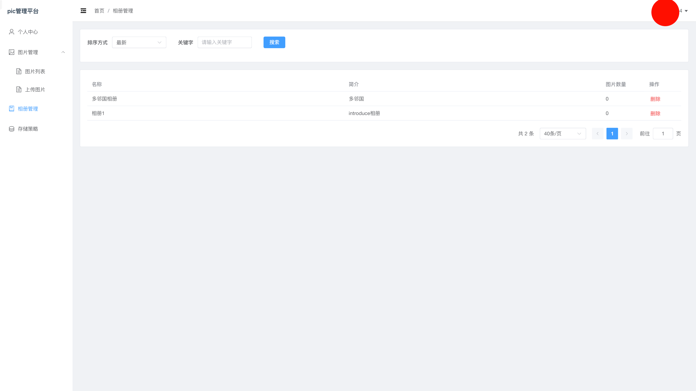

# Vue 3 + Vite

## ts支持

参考文档：
[Vue3 TypeScript 支持文档（中文）：](https://cn.vuejs.org/guide/typescript/overview.html)

运行：node版本：>=20

pnpm i
pnpm dev

打包：
pnpm build

## 官方文档参考

- Element Plus: s
- Pinia: https://pinia.vuejs.org/zh/
- Vue Router: https://router.vuejs.org/zh/

1. Pinia 状态管理建议按模块划分
2. Vue Router 路由配置建议使用懒加载

# 图床管理后台设计方案

## 1. 引言

本文档旨在为 "PICUI" 图床服务设计一个配套的管理后台。

该后台将提供一个用户友好的图形界面，方便用户管理自己的图片、相册等资源。

设计内容包括后台的功能菜单、各功能模块的详细说明。

所有设计均基于官方 API 文档：[https://picui.cn/page/api-docs.html](https://picui.cn/page/api-docs.html)

**本项目代码可查**：绝对没有盗用token的api的行为，且只与[picui.cn](https://picui.cn/api/v1)进行交互，可以放心使用。

## 登录界面

## 2. 管理后台菜单设计

提供清晰的导航和功能分区，采用以下菜单结构：

- **个人中心**: 显示用户基本信息、容量使用情况等。
- **图片管理**
  - 图片列表: 浏览、搜索、筛选和删除用户的图片。
  - 上传图片: 提供上传新图片的功能。
- **相册管理**
  - 相册列表: 浏览、搜索和删除用户的相册。
- **存储策略**: 查看平台支持的所有存储策略。

## 3. 菜单功能与参数详解

### 3.1 个人中心

- **功能描述**: 作为后台首页，集中展示用户的核心信息。
- **对应API**: `GET /profile`
- **展示内容**:
  - 用户名、昵称、头像、邮箱
  - 容量信息: 以进度条形式展示 "已使用容量 / 总容量"。
  - 统计数据: 图片数量、相册数量。
  - 注册IP、个人主页地址等。
- **所需参数**: 无需用户输入，页面加载时自动请求API。

### 3.2 图片管理

#### 3.2.1 图片列表

- **功能描述**: 核心功能之一，提供完整的图片浏览和管理能力。
- **对应API**: `GET /images` (查询), `DELETE /images/:key` (删除)
- **界面设计**:
  - **筛选区**:
    - `排序方式 (order)`: 下拉选择框 (最新, 最早, 最大, 最小)。
    - `权限 (permission)`: 下拉选择框 (公开, 私有)。
    - `所属相册 (album_id)`: 下拉选择框 (需通过 `GET /albums` 接口获取相册列表来填充)。
    - `关键字 (q)`: 文本搜索框。
  - **内容区**:
    - 使用表格或卡片列表展示图片。
    - 每项信息包括：缩略图、图片名称、大小、上传日期、链接（URL/Markdown等，提供一键复制按钮）。
    - 操作列：提供 "删除" 按钮。点击后应有二次确认，确认后调用删除API。
  - **分页区**:
    - 支持页码跳转，显示总页数/总条数。

#### 3.2.2 上传图片

- **功能描述**: 提供一个多功能、配置丰富的图片上传界面。
- **对应API**: `POST /upload`
- **界面设计**:
  - 一个独立的页面或弹窗。
  - **表单输入项**:

    - `图片文件 (*file)`: **[必填]** 文件选择器，支持拖拽上传。
    - `权限 (permission)`: 单选按钮或下拉框 (公开=1, 私有=0)。
    - `存储策略 (strategy_id)`: 下拉选择框 (通过 `GET /strategies` 获取列表填充)。
    - `所属相册 (album_id)`: 下拉选择框 (通过 `GET /albums` 获取列表填充)。
    - `过期时间 (expired_at)`: 日期时间选择器，格式 `yyyy-MM-dd HH:mm:ss`。
  - **功能**:

    - 显示上传进度条。
    - 上传成功后，显示图片预览和各种格式的链接，并提供一键复制功能。

    

### 3.3 相册管理

#### 3.3.1 相册列表

- **功能描述**: 管理用户的相册集合。
- **对应API**: `GET /albums` (查询), `DELETE /albums/:id` (删除)
- **界面设计**:
  - **筛选区**:
    - `排序方式 (order)`: 下拉选择框 (最新, 最早, 图片最多, 图片最少)。
    - `关键字 (q)`: 文本搜索框。
  - **内容区**:
    - 使用表格或卡片列表展示相册。
    - 每项信息包括：相册名称、相册简介、包含图片数量。
    - 操作列：提供 "删除" 按钮，点击后二次确认。
  - **分页区**: 支持分页。

### 3.4 存储策略

- **功能描述**: 让用户了解当前图床支持哪些存储后端。
- **对应API**: `GET /strategies`
- **界面设计**:
  - 一个简单的列表页面。
  - **筛选区**:
    - `关键字 (q)`: 文本搜索框。
  - **内容区**:
    - 列表展示所有策略的 `id` 和 `nam`

feat: 2.0升级
1. 支持一次性清空所有的图片。
2. 支持批量下载图片。
3. 图片列表的表格宽度可调。
4. 批量删除图片的时候，根据每个请求的是否完成，判断是否成功删除，并且提供进度条。
feat:2.1 新增登录功能，支持URL参数和localStorage自动填充token，提升用户体验。